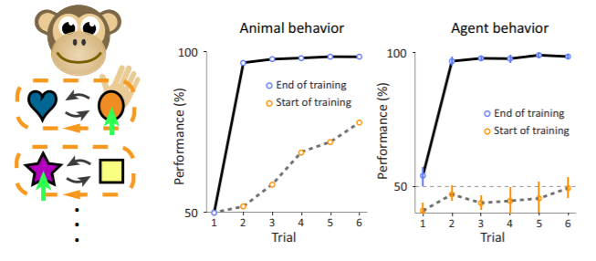
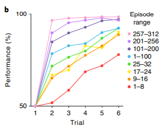
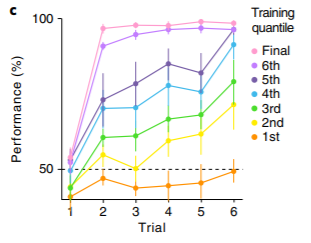
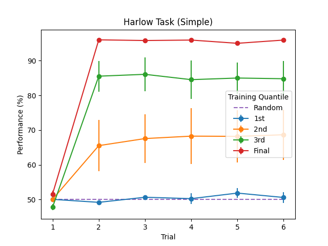

# Meta-RL: Harlow Visual Fixation Task (PyTorch)

In this repository, I reproduce the results of [Prefrontal Cortex as a Meta-Reinforcement Learning System](https://www.nature.com/articles/s41593-018-0147-8)<sup>1</sup> and [Learning to Reinforcement Learn](https://arxiv.org/abs/1611.05763)<sup>2</sup> on two variants of the Harlow "learning to learn" visual fixation task. The first variant is one-dimensional version of the task that I created as a sanity check for my implementation, it is still able to showcase the same one-shot learning behavior and is a good starting point for those starting to delve into Meta-RL. The other variant is part of DeepMind's [PsychLab](https://deepmind.com/blog/article/open-sourcing-psychlab), which is a virtual environment that aims to study specifc cognitive skills of artificial agents by recreating experiments from cognitive pyschology. Here I am using a task that was inspired by Harlow's experiment in [The Formulation of Learning Sets](https://psycnet.apa.org/record/1949-03097-001)<sup>3</sup> in which a monkey was continually presented with new stimuli and was required to learn the task's structure in order to attain the food reward, thus requiring learning in its fullest sense. You will find below a description of the task with results, along with a brief overview of Meta-RL and its connection to neuroscience, as well as details covering the structure of the code.

*Note: I have a related repository on the ["Two-Step" task](https://github.com/BKHMSI/Meta-RL-TwoStep-Task) with episodic LSTMs in case you are interested :)

**I am still working on reproducing the PsychLab results, training takes forever ¯\\\_(ツ)\_/¯

<table align="center" width="100%">
    <tr>
        <th colspan="5">Harlow PsychLab (still not working)</th>
        <th>Harlow Simple</th>
    </tr>
    <tr>
        <td align="center" width="15%">
            
        </td>
        <td align="center" width="15%">
            
        </td>
        <td align="center" width="15%">
            
        </td>
        <td align="center" width="15%">
            
        </td>
        <td align="center" width="15%">
            
        </td>
        <td align="center" width="25%"></td>
    </tr>
</table>

## Overview of Meta-RL

In recent years, deep reinforcement learning (deep-RL) have been in the forefront of artificial intelligence research since DeepMind's seminal work on DQN<sup>5</sup> that was able to solve a wide range of Atari games by just looking at the raw pixels, as a human would. However, there remained a major issue that disqualified it as a plausible model of human learning, and that is the sample efficiency problem. It basically refers "to the amount of data required for a learning system to attain any chosen target level of performance"<sup>6</sup>. In other words, a task that would take a biological brain a matter of minutes to master would require many orders of magnitude more training data for a deep-RL artificial agent. Botvinick et al. (2019)<sup>6</sup> identify two main sources of slowness in deep-RL: the need for *incremental parameter adjustment* and starting with a *weak inductive bias*. I will be going into more details of each in my blog post. However, they note that subsequent research has shown that it is possible to train artificial agents in a sample efficient manner, and that is by (1) augmenting it with an episodic memory system to avoid redundant exploration and leverage prior experience more effectively, and (2) using a meta-learning approach by training the agent on a series of structurally interrelated tasks that can strengthen the inductive bias (narrowing the hypothesis set) which enables the agent to hone-in to a valid solution much faster<sup>6</sup>.

### Connection with Neuroscience

DeepMind have been preaching about the importance of neuroscience and artificial intelligence research to work together in what they call a virtuous circle; where each field will inspire and drive forward the other<sup>7</sup>. I must admit that they were the reason I joined an MSc program in Computational Cognitive Neuroscience after working on AI for a couple of years now. In short, they were indeed able to show that meta-RL - which was drawn from the machine learning literature - is able to explain a wide range of neuroscientific findings as well as resolve many of the prevailing quandaries in reward-based learning<sup>1</sup>. They do so by conceptualizing the prefrontal cortex along with its subcortical components (basal ganglia and thalamic nuclei) as its own free standing meta-RL system. Concretely, they show that dopamine driven synaptic plasticity, that is model free, gives rise to a second more efficient model-based RL algorithm implemented in the prefrontal's network activation dynamics<sup>1</sup>. In this repository, I reproduce one of their simulations (the Harlow visual fixation task) that showcases the emergence of one-shot learning behavior in accord to what has been observed in humans and non-human primates<sup>1</sup>. 

## The Harlow Task

<table align="center" width="100%">
    <tr>
        <td align="center" width="50%"></td>
    </tr>
    <tr>
        <td align="center">Taken from Reinforcement Learning Fast and Slow<sup>6</sup> </td>
    </tr>
</table>

In the original task, a monkey was presented with two unfamilar objects, one covering a well containing food and the an other empty well. The animal could choose freely between one of the two objects and retrieve the food reward if present. The objects swapped positions randomly at the beginning of every trial and after six trials a new episode began with two new objects the monkey haven't seen before. The gist is throughout an episode one object consistently contained the reward while the other not. The idea is for the monkey to learn which object that is regardless of position, and once the objects were substituded for new ones it should converge to the correct object after only one trial. The monkey was indeed able to show perfect performance after substantial practice reflecting an understanding of the tasks's rules. The same is true for the artificial agent I am presenting here with two variants of that same task.

## Results

The results below, which this code reproduces, shows the model performance at `m` successive stages of training averaged across `n` networks.

<table align="center">
    <tr>
        <th>Data from Harlow <sup>3</sup></th>
        <th>Published Result <sup>1</sup></th>
        <th>My Result (PsychLab)</th>
        <th>My Result (Simple)</th>
    </tr>
    <tr>
        <td align="center" width="25%"></td>
        <td align="center" width="25%"></td>
        <td align="center" width="25%"></td>
        <td align="center" width="25%"></td>
    </tr>
</table>

## Models

I am using the same model as presented in [Learning to Reinforcement Learn](https://arxiv.org/abs/1611.05763)<sup>2</sup> which consists of an encoder (that is a convolutional network in the case of PsychLab and an MLP for the simpler version) and the working memory which is either a one-layer LSTM or two-layer stacked LSTM. The training parameters are as specified in the methods section of [Prefrontal Cortex as a Meta-Reinforcement Learning System](https://www.nature.com/articles/s41593-018-0147-8)<sup>1</sup> which I refer the reader to, it can also be found in the configuration files in this repository. I tried different tricks in an attempt to speed the convergence of the PsychLab task, such as intializing the convolutional network with weights pretrained on CIFAR100 and playing with the reward strategy. I aim to try an episodic version to see if that would lead to faster convergence. This is still in progress.

## Getting Started with PsychLab 

1. Follow this [build documentation](https://github.com/deepmind/lab/blob/master/docs/users/build.md) from DeepMind Lab
2. Clone this repository into the root directory of `lab`
3. Edit `BUILD` by adding 
    ```
        py_binary(
            name = "python_harlow",
            srcs = ["Meta-RL-Harlow/main_psychlab.py"],
            data = [":deepmind_lab.so"],
            main = "Meta-RL-Harlow/main_psychlab.py",
            visibility = ["//python/tests:__subpackages__"],
            deps = ["@six_archive//:six"],
        )
    ```
4. Run this command from the root directory of `lab`  
    ```
    bazel run :python_harlow -- --level_script contributed/psychlab/harlow --width=136 --height=136
    ``` 


## Code Structure

``` bash
Meta-RL-Harlow
├── LICENSE
├── README.md # this file 
├── main_psychlab.py # psychlab task
├── main_simple.py   # simpler task
├── vis_simple.py # code for visualizing one episode of the simple version
├── plot.py # plots results
└── Harlow_PsychLab
    ├── config.yaml # configuration file
    ├── harlow.py # wrapper for deepmind_lab
    └── train.py # training code for this task
└── Harlow_Simple
    ├── config.yaml # configuration file
    ├── harlow.py # the one-dimensional harlow task
    └── train.py # training code for this task
└── models
    ├── a3c_lstm.py # advantage actor-critic (a3c) algorithm with working memory with stacked version for PsychLab
    ├── a3c_conv_lstm.py # advantage actor-critic (a3c) algorithm with pretrained convnet and working memory with stacked version
    ├── a3c_lstm_simple.py # advantage actor-critic (a3c) algorithm for the simpler version
    ├── a3c_dnd_lstm.py # a3c algorithm with working memory and long-term (episodic) memory
    ├── dnd.py # episodic memory as a differentiable neural dictionary
    ├── ep_lstm.py # episodic lstm module wrapper
    └── ep_lstm_cell.py # episodic lstm cell with extra reinstatement gate

```

## References

1. Wang, J., Kurth-Nelson, Z., Kumaran, D., Tirumala, D., Soyer, H., Leibo, J., Hassabis, D., & Botvinick, M. (2018). [Prefrontal Cortex as a Meta-Reinforcement Learning System](https://www.nature.com/articles/s41593-018-0147-8). *Nat Neurosci*, **21**, 860–868.

2. Jane X. Wang and Zeb Kurth-Nelson and Dhruva Tirumala and Hubert Soyer and Joel Z. Leibo and Rémi Munos and Charles Blundell and Dharshan Kumaran and Matthew Botvinick (2016). [Learning to reinforcement learn](https://arxiv.org/abs/1611.05763). CoRR, abs/1611.05763.

3. Harlow, H. F. (1949). [The formation of learning sets](https://psycnet.apa.org/record/1949-03097-001). Psychological Review, 56(1), 51–65. https://doi.org/10.1037/h0062474

5. Mnih, Volodymyr & Kavukcuoglu, Koray & Silver, David & Rusu, Andrei & Veness, Joel & Bellemare, Marc & Graves, Alex & Riedmiller, Martin & Fidjeland, Andreas & Ostrovski, Georg & Petersen, Stig & Beattie, Charles & Sadik, Amir & Antonoglou, Ioannis & King, Helen & Kumaran, Dharshan & Wierstra, Daan & Legg, Shane & Hassabis, Demis. (2015). [Human-level control through deep reinforcement learning](https://www.nature.com/articles/nature14236). Nature. 518. 529-33. 10.1038/nature14236. 

6. Botvinick, Mathew & Ritter, Sam & Wang, Jane & Kurth-Nelson, Zeb & Blundell, Charles & Hassabis, Demis. (2019). [Reinforcement Learning, Fast and Slow](https://www.cell.com/trends/cognitive-sciences/fulltext/S1364-6613(19)30061-0). Trends in Cognitive Sciences. 23. 10.1016/j.tics.2019.02.006. 

7. Hassabis, Demis & Kumaran, Dharshan & Summerfield, Christopher & Botvinick, Matthew. (2017). [Neuroscience-Inspired Artificial Intelligence](https://www.cell.com/neuron/fulltext/S0896-6273(17)30509-3). Neuron. 95. 245-258. 10.1016/j.neuron.2017.06.011. 

10. Mnih, V., Badia, A.P., Mirza, M., Graves, A., Lillicrap, T., Harley, T., Silver, D. & Kavukcuoglu, K.. (2016). [Asynchronous Methods for Deep Reinforcement Learning](https://arxiv.org/abs/1602.01783). Proceedings of The 33rd International Conference on Machine Learning, in *PMLR* 48:1928-1937

## Acknowledgments

I would like to give a shout out to those repositories and blog posts. They were of great help to me when implementing this project. Make sure to check them out!

- https://github.com/ikostrikov/pytorch-a3c
- https://github.com/mtrazzi/harlow 
